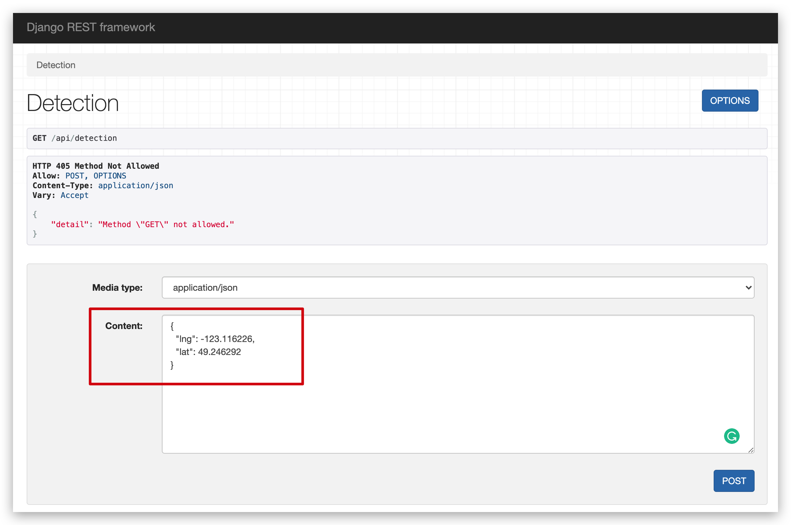
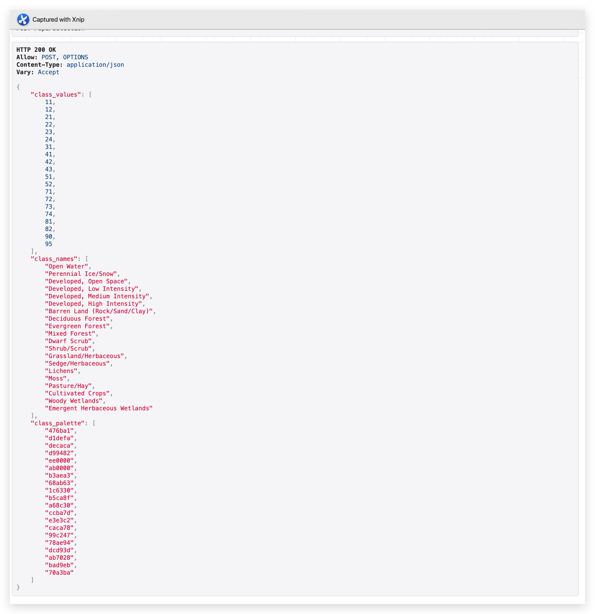

# Backend Detection Demo

## Notice

I only add a demo endpoint for change detection. It will receive the longitude and latitude from the user and give back the supervised learning results derived from geemap.

The response should contain both the result image and legend info. I only finished the legend info part. The image part is very hard and has several difficulties that need group discussions.

## How to run the repo

1. Make sure installing the following dependencies first.

```
  pip install django djangorestframework
  pip install ee
  pip install geemap
```

2. Go to the root folder and run the following commands.

```
  python3 ./manage.py makemirgrations
  python3 ./manage.py migrate
  python3 ./manage.py runserver
```

3. The server will start at http://127.0.0.1:8000/.

4. Go the detection endpoint http://127.0.0.1:8000/api/detection.

5. You will the following REST playground.
   

6. Put geo information in the content field, and click post.

```
{
  "lng": -123.116226,
  "lat": 49.246292
}
```

7. You will get the similar response as shown below.
   
